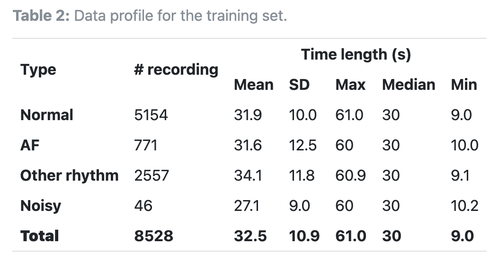

# Physionet-challenge

## About 📖

This repo contains experiments related to the [2017 AF Physionet Challenge](https://physionet.org/content/challenge-2017/1.0.0/).

## IPython Notebooks 🐍	

IPython notebooks are contained in [./src](./src). Each notebook is self contained, you can view the notebook and the cell outputs directly in github by navigating to the relevent `.ipynb` file. 

If you wish to run the notebooks I recomend using [Google Colab](https://colab.research.google.com/notebooks/intro.ipynb?utm_source=scs-index) or running an instance of [Jupyter](https://jupyter-notebook-beginner-guide.readthedocs.io/en/latest/execute.html) locally (Although if you go that route you need to ensure you are running it in an environment that has the required dependencies installed).

| Notebook  | Description |
| ------------- | ------------- |
| [exploration](./src/exploration.ipynb)  | exploration of competition data  |
| [model](./src/model.ipynb) | Binary classification (`af / normal`) using a CNN  |
| [peak_analysis](./src/peak_analysis.ipynb) | Binary classification (`af / normal`) using variance of QRS distance  |

## Data 🖨️

The original competition data can be downloaded [here](https://physionet.org/static/published-projects/challenge-2017/af-classification-from-a-short-single-lead-ecg-recording-the-physionet-computing-in-cardiology-challenge-2017-1.0.0.zip).

the data has been exported into [./data](./data) and regrouped it in folders by set (`training / validation`) and label (`normal / af / noisy / other`). The composition of the training data can be found bellow:

the script used to reorganise the data by label is [organise_data.py](./organise_data.py)

